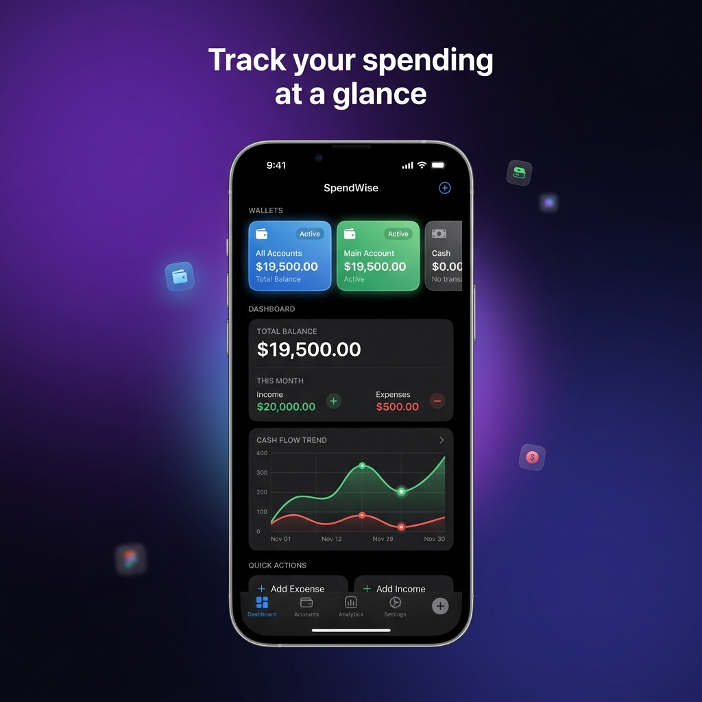
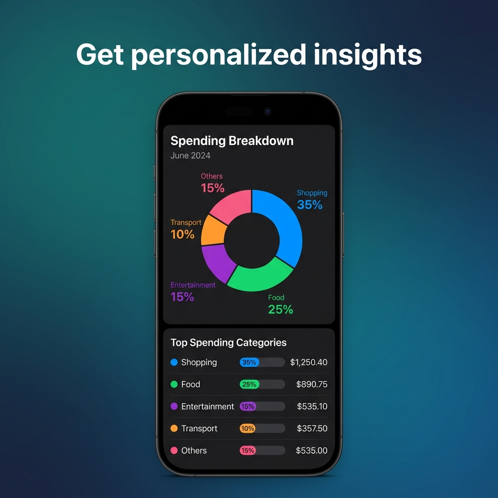
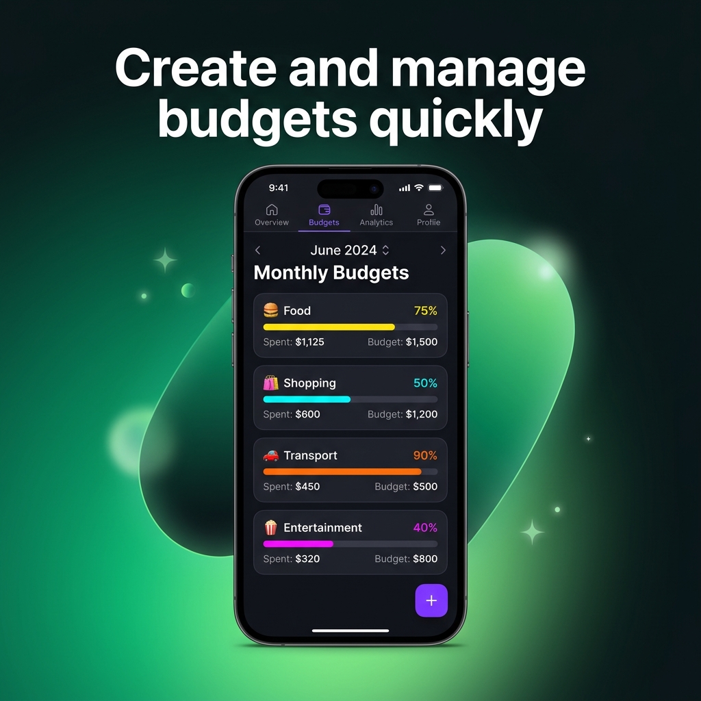
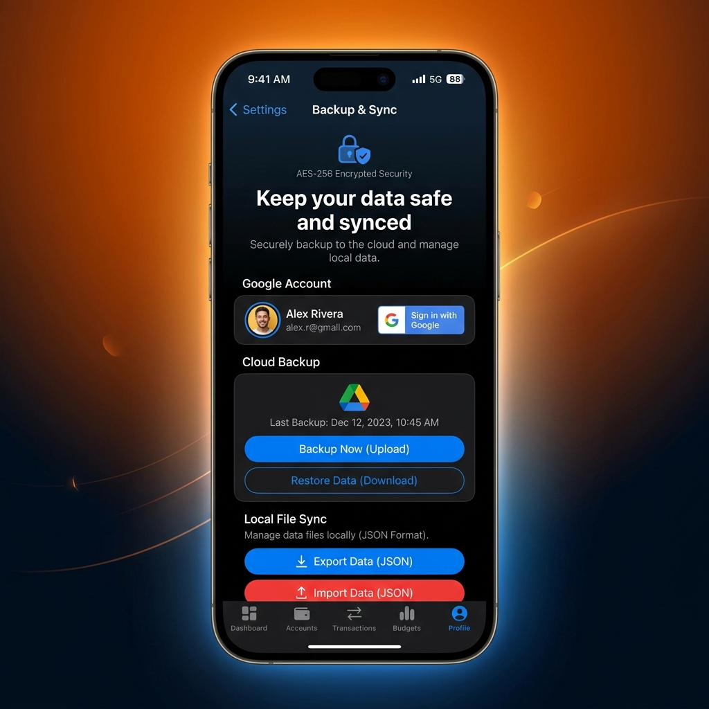
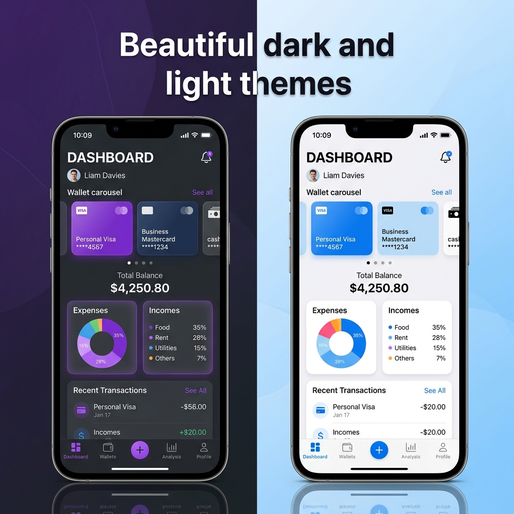

<p align="center">
  <h1 align="center">💰 Personal Expense Tracker</h1>
  <p align="center">
    A beautifully designed, full-featured personal finance app built with Flutter.<br/>
    Track expenses, manage multiple wallets, set budgets, and keep your data safe with encrypted backups.
  </p>
</p>

<p align="center">
  
  
  
  
  
</p>

---

## 📸 App Showcase

<p align="center">
  
  
  
  
  
</p>

<p align="center">
  <b>Track Spending</b>&nbsp;&nbsp;&nbsp;&nbsp;&nbsp;
  <b>Multi-Wallet</b>&nbsp;&nbsp;&nbsp;&nbsp;&nbsp;&nbsp;&nbsp;
  <b>Smart Insights</b>&nbsp;&nbsp;&nbsp;&nbsp;&nbsp;
  <b>Budget Control</b>&nbsp;&nbsp;&nbsp;&nbsp;&nbsp;
  <b>Backup & Sync</b>
</p>

<p align="center">
  
</p>
<p align="center"><b>🎨 Beautiful Dark & Light Themes</b></p>

---

## ✨ Features

### 📊 Dashboard
- **At-a-glance financial overview** — total balance, income, and expenses
- **Multi-wallet carousel** — swipe between accounts (Main Account, Cash, Savings, etc.)
- **Cash Flow Trend chart** — 6-month interactive line chart showing income vs. expense trends
- **Expenses by Category** — donut chart with percentage breakdown
- **Recent Transactions** — quick-view list with swipe-to-view-all

### 💳 Multi-Wallet Management
- Create unlimited wallets with custom names, colors, and icons
- **"All Accounts"** aggregate view with combined totals
- Per-wallet balance tracking with income/expense split
- Inter-wallet transfers

### 📝 Transaction Management
- **Income, Expense & Transfer** transaction types
- Categorized entries with custom categories and icons
- Date picker for backdated entries
- Notes/memo for each transaction
- Full transaction history with search and filtering

### 📈 Budget Tracking
- Set **monthly budgets** per expense category
- Visual progress bars showing budget consumption
- Month-by-month navigation
- Overspend alerts with color-coded indicators

### ☁️ Backup & Sync
- **Google Drive Cloud Backup** — encrypted backup to your Google account's app data folder
- **Local JSON File Backup** — export AES-256 encrypted backup files to device storage
- **Restore from file** — import and decrypt backup files with passcode verification
- Backup metadata display (last backup date, size)

### 🎨 Theming
- **Dark Mode** — sleek dark theme with purple/pink accents and glassmorphism cards
- **Light Mode** — clean, modern light theme with blue accents
- One-tap theme toggle from the dashboard

---

## 🏗️ Architecture

The project follows a **modular, feature-first architecture** powered by [GetX](https://pub.dev/packages/get) for state management, dependency injection, and routing.

```
lib/
├── main.dart                          # App entry point
└── app/
    ├── core/
    │   ├── controllers/               # Global controllers (ThemeController)
    │   ├── database/                  # SQLite database helper & migrations
    │   ├── models/                    # Data models
    │   │   ├── budget_model.dart
    │   │   ├── category_model.dart
    │   │   ├── transaction_model.dart
    │   │   └── wallet_model.dart
    │   ├── services/                  # Business logic services
    │   │   ├── encryption_service.dart    # AES-256 encryption
    │   │   └── google_drive_service.dart  # Google Drive API integration
    │   ├── theme/                     # App themes (dark & light)
    │   └── widgets/                   # Shared UI components (GlassCard)
    ├── modules/
    │   ├── dashboard/                 # Home screen, charts, wallet carousel
    │   ├── transactions/              # Transaction list & detail views
    │   ├── add_transaction/           # Add/edit transaction form
    │   ├── budget/                    # Monthly budget management
    │   └── backup/                    # Cloud & local backup/restore
    └── routes/                        # GetX route definitions
```

---

## 🛠️ Tech Stack

| Layer | Technology |
|:------|:-----------|
| **Framework** | Flutter 3.41+ |
| **Language** | Dart 3.11+ |
| **State Management** | GetX |
| **Local Database** | SQLite (sqflite) |
| **Charts** | FL Chart |
| **Authentication** | Google Sign-In v7 |
| **Cloud Storage** | Google Drive API (googleapis) |
| **Encryption** | AES-256 (encrypt + crypto) |
| **File Operations** | file_picker, path_provider |
| **Secure Storage** | flutter_secure_storage |

---

## 🚀 Getting Started

### Prerequisites

- Flutter SDK **3.41+** ([Install Flutter](https://docs.flutter.dev/get-started/install))
- Dart SDK **3.11+**
- Android Studio / Xcode (for mobile builds)

### Installation

1. **Clone the repository**
   ```bash
   git clone https://github.com/yourusername/expense_tracker.git
   cd expense_tracker
   ```

2. **Install dependencies**
   ```bash
   flutter pub get
   ```

3. **Run the app**
   ```bash
   # Android
   flutter run

   # iOS
   flutter run -d ios

   # macOS
   flutter run -d macos
   ```

### Google Sign-In Setup (Optional — for Cloud Backup)

To enable Google Drive cloud backup, you need to configure Google Sign-In for your platform:

<details>
<summary><strong>Android Setup</strong></summary>

1. Create a project in the [Google Cloud Console](https://console.cloud.google.com/)
2. Enable the **Google Drive API**
3. Create an **OAuth 2.0 Client ID** for Android
4. Download `google-services.json` and place it in `android/app/`
5. Add your SHA-1 fingerprint to the OAuth client

</details>

<details>
<summary><strong>iOS / macOS Setup</strong></summary>

1. Create an **OAuth 2.0 Client ID** for iOS in Google Cloud Console
2. Download `GoogleService-Info.plist` and add it to your Xcode project
3. Add the required URL schemes to `Info.plist`
4. For macOS, ensure the `com.apple.security.network.client` entitlement is enabled

</details>

---

## 🔐 Security

- **AES-256 Encryption** — All backup files (local and cloud) are encrypted with a user-provided passcode
- **No plain-text storage** — Sensitive data never leaves the device unencrypted
- **Passcode-protected restore** — Backups can only be restored with the correct passcode
- **Google Drive App Data** — Cloud backups are stored in the app's hidden data folder, invisible to the user in Google Drive

---

## 📱 Supported Platforms

| Platform | Status |
|:---------|:-------|
| Android  | ✅ Supported |
| iOS      | ✅ Supported |
| macOS    | ✅ Supported |
| Web      | 🔄 Partial (no local DB) |
| Windows  | 🔄 Partial |
| Linux    | 🔄 Partial |

---

## 🧪 Testing

```bash
# Run all tests
flutter test

# Run static analysis
flutter analyze
```

---

## 📦 Dependencies

| Package | Version | Purpose |
|:--------|:--------|:--------|
| `get` | ^4.7.3 | State management, DI & routing |
| `sqflite` | ^2.4.2 | SQLite database |
| `fl_chart` | ^1.2.0 | Interactive charts |
| `google_sign_in` | ^7.2.0 | Google authentication |
| `googleapis` | ^16.0.0 | Google Drive API |
| `encrypt` | ^5.0.3 | AES encryption |
| `crypto` | ^3.0.7 | Cryptographic hashing |
| `file_picker` | ^11.0.2 | File save/open dialogs |
| `path_provider` | ^2.1.5 | Platform file paths |
| `flutter_secure_storage` | ^10.3.1 | Secure key-value storage |
| `intl` | ^0.20.2 | Date/number formatting |
| `http` | ^1.6.0 | HTTP client |
| `share_plus` | ^10.1.3 | File sharing |

---

## 🤝 Contributing

Contributions are welcome! Please follow these steps:

1. Fork the repository
2. Create your feature branch (`git checkout -b feature/amazing-feature`)
3. Commit your changes (`git commit -m 'Add some amazing feature'`)
4. Push to the branch (`git push origin feature/amazing-feature`)
5. Open a Pull Request

---

## 📄 License

This project is licensed under the MIT License — see the [LICENSE](LICENSE) file for details.

---

<p align="center">
  Made with ❤️ and Flutter
</p>
